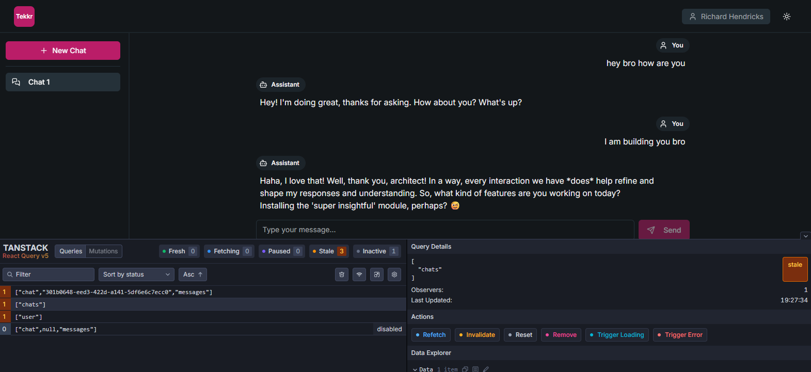
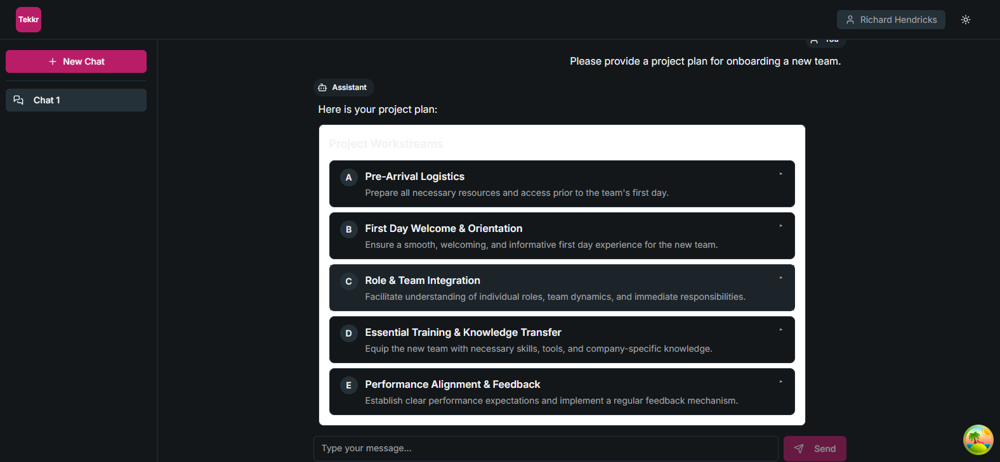

# Challenge 1 (BASIC IMPLEMENTATION)



# Challenge 2 (INLINE PREVIEW FOR PROJECT PLANS)


# NOTE
* Implemented the basic flow for now.
* You can update the Gemini API key and add a `.env` file on the server with:
```
OPENAI_API_KEY=""
OPENAI_MODEL="gpt-4o-mini"

GEMINI_API_KEY=""
GEMINI_MODEL="gemini-2.5-flash"
```
* Skipped adding ChatGPT flow because it’s currently only available for premium users, and I don’t have premium access for api key of OpenAI.
* Didn’t implemented the bonus part (AI Model selector) since I don’t have any additional premium API keys (e.g., OpenAI) to test the flow.